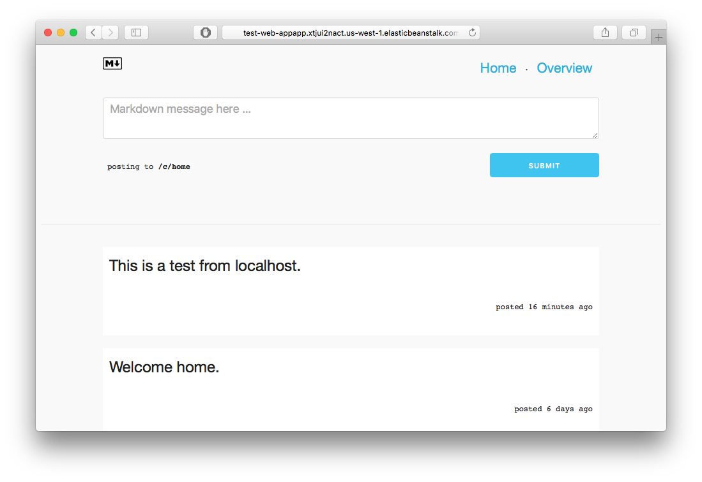

 
# Message Board. 

This project contains a message board which allows users to post markdown enabled comments witin various communities (similar to subreddits). This project is built to help you get started with AWS CodeStar. It contains everything you'd need to get started with a realistic Node.js application.

Technology Used
----------

* [Express.js](expressjs.com) - The server which handles all the post requests for content. 
* [Redis](https://redis.io) - Caching and displaying the data for the chart.
* [DynamoDB](https://aws.amazon.com/dynamodb/) - Storing all the messages on the board.

Folder Structure
-----------

* `.ebextensions/` - Contains the configuration files that
  AWS Elastic Beanstalk will deploy your Express application.
* `package.json` - Contains various metadata and dependencies.
* `app.js` - The entrypoint for our express app.
* `public/` - Directory contains static web assets used by the application.

Getting Started Locally
---------------

These directions assume you want to develop on your local computer, and not
from the Amazon EC2 instance itself. If you are ready to deploy this to AWS,
then skip to the next section.

1. Install [Node.js](https://nodejs.org/en/download/) on your computer.  For details on available installers visit

2. Install NPM dependencies:

        $ npm install
3. Rename the `example.env` file to `.env` and place your `AWS_ACCESS_KEY_ID`, `AWS_SECRET_KEY`,`AWS_REGION`, 
and `REDIS_HOST` right after the respective `=` signs.

4. Make sure you have [redis installed](https://redis.io/topics/quickstart) locally. Use the `redis-server`
command to run a redis server on your localhost.

5. Create a DynamoDB table called `messages`.

6. Start the development server:

        $ node app.js

7. Open `http://127.0.0.1:3000/` in a web browser to view your application.

Deploying to AWS using CodeStar
------------------

(instructions coming soon)